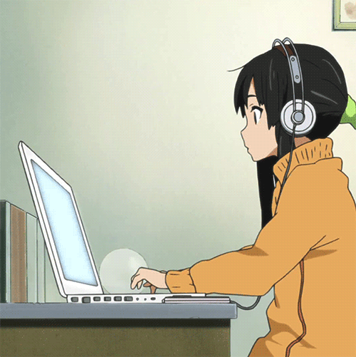

<h2 align="center">Hi 👋, I'm Kiandra</h2>

💻 &nbsp; I'm working on **building web apps**  
🎮 &nbsp; My side project is **my first video game**  
🌱 &nbsp; I’m currently learning **Redux & Express**  
⚡ &nbsp; Fun fact: **I don't like ☕️**

<h4>Languages & Frameworks</h4>

